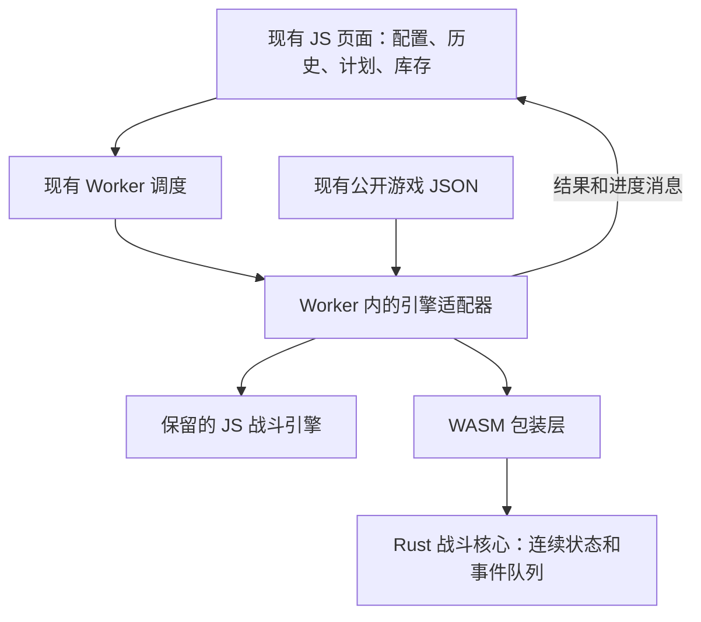

# 战斗模拟器 Rust / WebAssembly 改造计划

日期：2026-09-30。状态：已进入分步实施，P0 基准准备完成，P1 Rust/WASM 原型待执行。

代码依据：`testing` 分支 `2783b09784133c7618149f852c91309e0d8da6c3`。实施前重新核对工作树、数据版本和基准。本文中的新增目录、接口与命令都是计划项，不能当成已实现功能。

## 1. 这次改造要做到什么

把浏览器 Worker 内的战斗模拟引擎改为 Rust，编译成 WebAssembly（WASM），继续通过现有页面使用。保留一条完整、连续的战斗时间线，先证明计算结果与当前 JS 一致，再决定是否默认启用。

用户不需要学习 Rust、安装运行环境或改变使用流程。Rust 是开发语言；WASM 是编译后由浏览器执行的文件；Worker 是现有的后台计算线程。模拟仍在用户电脑上进行，服务器继续提供页面和已有同步服务。

| 项目 | 本次决定 |
| --- | --- |
| 迁移范围 | 战斗计算、角色战斗属性、技能、触发器、状态、事件队列、地图/地下城/迷宫过程、结果统计 |
| 继续使用 JS | 页面、配装编辑、导入导出、历史、计划、库存抵扣、制作准备时间、期望掉落展示、Worker 池调度 |
| 运行方式 | 每个现有计算 Worker 内一个单线程 WASM 实例；不同地图沿用现有 Worker 池并行 |
| 数据来源 | 现有公开游戏定义 JSON，保持一个权威来源，生成 Rust 所需资源 |
| 一致性标准 | 相同输入、种子、游戏数据下，对齐事件与随机流，再对齐完整战斗结果 |
| 默认切换门槛 | 正确性和兼容性全部通过；主要长场景的浏览器端到端中位用时至少改善 2 倍 |
| 性能目标 | 争取 3–5 倍；接近 4 秒属于更高目标，需实测证明 |
| 工期 | 约 11–20 个工作日；若浮点/事件细节对齐困难，预留至 3–6 周 |

现有配装排序、经验读取、消耗品准备、钥匙碎片共享库存抵扣、历史批量删除已经完成。这次用回归测试保护这些功能，不把它们重新开发一遍。

## 2. 现状与改造边界

当前 `src/combatsimulator/` 有 36 个 JS 文件，约 4,489 行；公开定义数据有 16 个 JSON，合计约 4.1 MiB。这个数量不包含整个页面和所有辅助逻辑，数据中也有战斗以外的字段。

主要入口和职责如下：

| 现有文件 | 迁移处理 |
| --- | --- |
| `src/worker.js` | 保留消息入口，新增引擎选择、WASM 初始化与结果适配 |
| `src/combatsimulator/combatSimulator.js` | 主迁移对象：事件处理、战斗推进、技能释放、换波、团灭 |
| `combatUnit.js`、`player.js`、`monster.js` | 迁移运行时角色状态和属性计算；页面编辑所用 JS 类暂时保留 |
| `combatUtilities.js` | 迁移命中、暴击、伤害、治疗、吸血、取整等计算 |
| `ability.js`、`trigger.js`、`consumable.js`、`buff.js` | 迁移冷却、条件检查、消耗品和增益状态 |
| `equipment.js`、`houseRoom.js`、`achievement.js` | 迁移战斗属性输入的解释与计算 |
| `events/eventQueue.js` 和各事件类 | 改为 Rust 的事件类型与兼容堆算法 |
| `zone.js`、`labyrinth.js` | 迁移刷怪、地下城进度、迷宫次数/时间限制与箱子增益 |
| `simResult.js` | 迁移统计，输出保持现有字段结构 |
| `src/guildCombatShrines.js` | 显式纳入对齐范围，不能只迁移战斗目录而漏掉公会增益 |
| `src/multiWorker.js`、`simulationWorkerPool.js` | 沿用现有任务顺序、并发限制、复用与清理机制 |

此前 JS 优化报告的 72 小时五人海盗基地 T2 用时中位数为 40.73 秒，浏览器一次为 33.59 秒；测试时存在其他负载，不能当作现在的受控基线。实施时重新测当前版本，不能再用优化前约 392 秒来夸大 Rust 收益。参见 [JS 性能实测报告](./js-combat-simulator-performance-results.zh-CN.md)。

## 3. 技术路线

### 3.1 采用的工具

选择稳定版 Rust、Cargo、`wasm32-unknown-unknown` 目标、`wasm-bindgen` 与 `wasm-pack`，继续使用现有 Webpack 5。核心数据结构使用 Rust 标准库，输入输出用 `serde` / `serde_json`。第一版采用 JSON 字符串边界，方便复用 Node 基准与定位差异。

Rust 版本在原型首次构建成功后写入 `rust-toolchain.toml`；依赖锁定到 `Cargo.lock`；构建工具的精确版本写入构建脚本和说明。选择当时可用的稳定发布版本，验证后固定，不依赖会变化的 `latest` 或 nightly。`rust-version` 仅声明最低版本，不能代替精确工具链锁定。[Rust 工具链配置](https://rust-lang.github.io/rustup/overrides.html#the-toolchain-file)、[Cargo 版本声明](https://doc.rust-lang.org/cargo/reference/rust-version.html)

本机已确认 Node v18.16.1、npm 9.5.1 可用；当前 PATH 没有找到 `rustc`、`cargo`、`wasm-pack`。实施时先检查是否存在未加入 PATH 的安装，再准备工具。浏览器 WASM 的编译与 Windows 本地 Rust 测试是两件事：前者使用 WASM 目标，后者需要可用的 Windows MSVC 工具链。不要为这次计划改动现有 Node 或系统环境。[WASM 目标说明](https://doc.rust-lang.org/stable/rustc/platform-support/wasm32-unknown-unknown.html)、[Windows 目标说明](https://doc.rust-lang.org/rustc/platform-support/windows-msvc.html)

第一版不引入 Rust 线程、Rayon、共享内存或 SIMD 专项优化。现有 Worker 池已经解决多任务并行；先把单次模拟算对并测快，避免同时增加新的部署和兼容性要求。

### 3.2 拟新增结构

```text
rust/
  Cargo.toml                  # 工作区
  Cargo.lock
  combat-core/                # 纯 Rust 引擎，不访问浏览器或 JS 对象
    src/{input,data,rng,queue,unit,combat,zone,result}.rs
    tests/                    # 算法与规则测试
  combat-wasm/                # wasm-bindgen 包装，只做边界与生命周期
    src/lib.rs
  combat-cli/                 # 本机对照入口，复用同一个 core
rust-toolchain.toml
scripts/
  build-combat-wasm.cjs        # 工具版本检查、构建、清点产物
  prepare-combat-data.cjs      # 从现有 JSON 生成资源与数据指纹
src/
  combatEngineAdapter.js      # 共用输入规范化、引擎选择、消息适配
  wasmCombatRunner.js         # 初始化、分段运行、释放
.wasm-build/                   # 中间产物，忽略，不在 dist 内构建
tests/fixtures/combat/         # 人工公开测试队伍
```

`combat-cli` 用于快速查错，不是新服务器。Rust 核心尽量使用安全 Rust；不用 `unsafe`、自定义内存分配器或复杂框架作为起步条件。

### 3.3 运行结构



一个 Worker 只接受一个正在执行的任务。其 WASM 模块和不可变定义数据初始化一次，后续地图任务复用；队伍、事件、增益、统计和随机状态在每次任务开始时新建。任务结束释放运行对象，整个池结束或出错按现有机制销毁 Worker。

每个 Worker 有独立 WASM 内存。第一版不增加当前最多 8 个、低内存设备最多 2 个的调度上限；测得实际峰值后，如有需要只向下降并发。

## 4. 输入、输出与执行接口

### 4.1 对页面保持原消息

页面继续发送 `start_simulation`，包含 `players`、`zone` 或 `labyrinth`、`extra`、`simulationTimeLimit`。页面继续接收 `simulation_progress`、`simulation_result`、`simulation_error`。批量地图/迷宫继续走现有入口，结果保留原任务顺序。

适配器统一解释社区增益、印章、可选字段与历史 DTO。JS 对照与 WASM 使用同一份规范化输入，避免两套默认值。角色和战斗属性的实际计算仍需在 Rust 内实现，不能仅把每次计算转回 JS。

仅在内部增加以下信息：引擎标识、接口版本、游戏数据指纹、测试种子和运行标识。历史如需记录引擎/种子，采用可选字段，旧历史读取必须兼容。种子按每个模拟任务分配；批量调度顺序改变不能改变同一任务的种子。

### 4.2 Rust / WASM 边界

拟采用以下语义接口，具体命名在原型中固定：

| 接口 | 作用 |
| --- | --- |
| `init_data(data_json, data_hash, schema_version)` | 每个实例一次，验证并建立不可变定义与索引 |
| `start(input_json, seed)` | 新建运行对象，重建角色和初始事件，返回可释放的句柄 |
| `run_chunk(max_events)` | 在同一对象上继续处理最多指定数量事件，返回少量进度状态 |
| `get_time_series()` | 仅在现有进度通知需要时取累计 HP/MP 数据 |
| `finish_result()` | 完成后一次输出完整结果 JSON |
| `free()` | 释放当前模拟对象；异常时不复用损坏的实例 |

跨边界传递只发生在初始化、分段推进、约 250 ms 的进度和最终结果处。事件、攻击、随机数、触发器检查不逐次调用 JS。官方微基准可用于了解调用成本，不能证明整个模拟器会提速多少。[wasm-bindgen 基准说明](https://wasm-bindgen.github.io/wasm-bindgen/benchmarks/)

第一版以每段 1,000 个事件起步，按实测调整段大小。段落只限制这次函数处理多少事件，不重置战斗、不拆成独立短模拟。跨段保存完整状态和随机流。HP/MP 仍严格按累计每 1,000 个事件采样，不能受段大小影响；进度由 Worker 实时时钟节流，结束必须发 100%。

取消继续销毁对应 Worker，不需要为了取消而让每个事件检查页面消息。运行错误发送可读的错误码/说明，保留本机调试信息，不输出完整私人队伍。

### 4.3 结果兼容

保留完整 `simResult`：伤害、经验、消耗品、死亡、资源增减、存活时间、地下城完成/失败、迷宫尝试、增益/掉落基础统计、团灭日志及可选时序。字段名包括现有拼写 `minDungenonTime`、`maxDungenonTime`，暂时保留，避免破坏页面和旧历史。

对象键的展示顺序有意义时按 JS 的枚举顺序输出；数组顺序一律保留。JSON 的省略字段、`null`、空数组与空对象分别处理，不能用 Rust 默认序列化猜测。整数值、时间值与浮点值按原 JS Number 语义传递，避免让页面收到 BigInt。

## 5. 必须优先解决的对齐细节

### 5.1 相同时间的事件

现有队列是 `heap-js`，比较器只有 `a.time - b.time`。同时间事件的顺序来自堆内部算法，没有显式“先插入先执行”的承诺。

因此第一版 Rust 自写兼容堆，复制当前锁定版本的插入、弹出、删除规则。不能直接用 `BinaryHeap` 再加递增序号，也不能先改为延迟删除。删除仍按原堆数组的匹配快照顺序进行。

复用现有 5,000 次随机操作场景，跨语言比对每一步堆数组、弹出事件 ID、匹配查询与清理结果；补充大量同时间、删除队首/队中、清空再插入、按角色清除的案例。兼容堆通过后才接入战斗。

### 5.2 随机数

对照沿用现有基准，明确编号为 `mulberry32-js-number-v1`。P0 已发现：JS 的累积状态没有每次强转 32 位，超过 `2^53` 后会发生 Number 舍入；种子 1 在第 4,917,760 次调用首次不同于常规 wrapping-u32 实现。本次 72h 人工场景有 5,007,481 次调用，已跨过这个边界。

因此 Rust 第一版保存 f64 累积状态，并显式重现 JS 的 ToUint32、位运算和 `Math.imul`；不能只用常规 Mulberry32 的 u32 状态。用多种种子的短向量及至少 600 万次长向量校验，再核对整场调用次数和位置。若将来统一换 RNG，属于单独且显式的行为版本变更，不能修改已冻结的 JS 参考。

正式 JS 引擎在过渡期继续原来的随机方式；固定种子注入仅用于受控对照。WASM 正式模拟在 Worker 开始时生成种子，此后在 Rust 内推进。两次普通页面模拟不要求输出相同；相同种子的对照必须相同。种子初始化的随机调用不计入战斗随机次数。

命中、暴击、伤害尾数、选目标、初始技能冷却、随机刷怪等分支必须保持调用顺序；一次失败的抽取也不能省略。不能使用 Rust 的通用 RNG 替代而只要求平均 DPS 接近。

### 5.3 数值与对象顺序

战斗数值和事件时间第一版使用 `f64`，不改成 `f32`，也不把纳秒时间全部强转 `u64`。当前时间通过 JS Number 表示，部分运算有小数；现有循环可能处理到略超过时长上限的一个事件，这个行为也要保留。

按原表达式顺序进行加减乘除，不先做代数化简。属性、增益、装备、目标遍历用明确有序的数组或索引；Rust `HashMap` 只用于查找，不能决定战斗遍历和浮点累加顺序。

建立 `floor`、`ceil`、`round`、余数、默认值的兼容测试。JS 与 Rust 对负半数的四舍五入、缺省值、非有限数及类型转换存在需要审计的语义；先规范化输入，再进入强类型核心。有效旧配置必须兼容，确实无效的配置给出解释，不能默默改成另一套装备。

`Math.pow(..., 1.4)` 与 Rust `powf` 是重点风险：即使用 `f64`，也不能假设所有数学函数逐位相同。先测实际属性区间和临界值；出现差异时定位它是否改变概率比较或取整。处理方式优先为经过对照的兼容数学实现或不改变公式的属性缓存，不能直接放宽结果容差掩盖分支变化。若此项无法解决，WASM 留在试验状态并明确记录阻塞点。

### 5.4 身份、状态与地图边界

JS 的对象身份改为 Rust `UnitId` 加对象代次。相同 HRID 的两只怪不是同一只；仅在 JS 确实创建替代对象时分配新代次，同一对象复活沿用身份，事件清理遵守原规则。旧事件不能误命中新对象，也不能擅自忽略原本应继续执行的事件。技能和增益保留独立身份与有序执行状态；每个效果按原顺序读取和写回，通过缩短借用作用域、暂存当前步骤所需值满足 Rust 借用规则。不能把多个效果改成先统一读取、最后统一写回，否则后一个效果可能读不到前一个效果的变化。

地下城换波、Boss、团灭、复活、重启、技能释放结束与冷却检查全部按当前代码。地图里有效的 `battlesPerBoss = 10` 等现状显式保留；公开定义变为不可变后不能漏掉旧构造器造成的实际值。迷宫 120 秒判断的严格大于关系、房间等级、箱子叠加顺序和尝试计数都要覆盖。

与其他模拟器的 DPS 差异属于独立问题。迁移阶段以本项目 JS 为参考，不一边换语言一边修改战斗规则。

## 6. 对照测试与验收标准

### 6.1 先冻结可复现的 JS 参考

实施第一步从当前提交生成独立 JS 基准包，保存代码 SHA、输入指纹、游戏数据指纹、Node/浏览器版本、种子、可视化设置和运行参数。迁移中保留这个包，不随源码重新生成。

复用 `bench/run.cjs` 和 `bench/compare.cjs`，扩展为同一输入可执行 JS、Rust 本机、实际 WASM 三种实现。Rust 本机通过只是诊断依据，浏览器实际 WASM 才是发布依据。

私人队伍与原始报告继续放在仓库外或已忽略的 `.bench/`；公开自动化使用人工构造的队伍。公开测试覆盖现实功能组合，但不从用户快照删个名字就当作可公开测试数据。

### 6.2 测试矩阵

| 层次 | 场景 | 必须对齐的内容 |
| --- | --- | --- |
| 算法 | RNG、兼容堆、取整、属性、伤害、治疗、增益叠加 | 随机值、调用次数、事件顺序、数值和边界 |
| 现有六个场景 | 地下城种子 7、HP/MP 种子 42、单人团灭、三人海洋星球、单人地狱深渊、独眼巨人迷宫 | 完整结果；沿用现有场景参数 |
| 战斗机制 | 普攻、释放/冷却、触发条件、食物饮料、持续伤害、再生、控制过期、反伤/反击、吸血/吸蓝、嘲讽/目标选择、狂暴和晋升等实际分支 | 分支覆盖与事件级对照，不只看 DPS |
| 角色属性 | 强化、房屋、成就、神龛、额外社区/个人增益、缺省字段、配装导入 | 属性值、增益顺序和结果 |
| 地图 | 1–5 人、普通区、四地下城有效难度、Boss/换波/失败重启；不同迷宫、等级和箱子组合 | 完成、失败、波数、时间、尝试与统计 |
| 长模拟 | 固定队伍海盗基地 T2 72 小时，多种种子；其他高事件量场景 | 全程无累计漂移、随机流与完整结果 |
| 分段 | 同一案例按 1、999、1000、1001、10000 个事件分段 | 最终结果、RNG、HP/MP 样本完全相同 |
| Worker | 单图、全图、全迷宫、重复运行、取消后重开、加载失败、运行错误 | 进度、结果顺序、复用、内存释放和错误清理 |
| 页面回归 | 导入、改装备重算、历史保存/导入/批删、计划经验与消耗品、跨图碎片库存抵扣 | 当前已有功能与旧记录继续工作 |

短场景首先使用固定种子 `1、7、42`，再加入至少 20 个种子。长场景至少三个种子。测试数量是最低覆盖起点，不代替技能与状态分支清单；发现遗漏就补针对性案例。

### 6.3 什么算一致

对完整结果做结构比较：对象键排序只用于比较，数组顺序不改；仅排除 `wipeEvents[].timestamp` 这种现实时间戳，以及新加的引擎诊断元数据。伤害、死亡、消耗品、经验、时间、团灭细节、HP/MP 样本等不能因为“看起来差不多”被排除。

先比较 JSON 解析后的值，再计算由 JS 统一序列化的规范化结果哈希，避免 Rust/JS 的 JSON 数字文本格式差异被误判为战斗差异。第一轮要求数值相等；整数计数、事件顺序、RNG 流和影响分支的值始终严格一致。

若只有不影响任何分支的浮点汇总发生末位差异，必须先定位来源、证明事件轨迹不变，单独列明字段和最大误差，再决定兼容处理；不能先设通用的“允许 1% 偏差”。任何分支或随机调用变化都按失败处理。

调试模式记录事件号、类型、模拟时间、源/目标身份、RNG 序号和少量状态摘要；差异工具报告第一个不同的位置及前后事件。跟踪只对失败短案例开启，正式性能测试关闭，避免日志成为热点或泄露配置。

## 7. 性能验证与优化顺序

### 7.1 计时方式

比较当前优化 JS 与实际 WASM，不能只比较 Rust 本机执行，也不能只测伤害公式微基准。

测两组时间：首次使用的端到端时间，包含加载、实例化、数据初始化、输入转换、模拟、结果转换和页面更新；模块已加载后的端到端时间，仍包含每次任务重建和结果转换。另记纯核心时间用于定位，不用于代替用户等待时间。

在同一台电脑、同一浏览器、相同输入/种子/数据下，关闭其他重负载任务，先各做两次预热，再交替测至少五次 JS 与 WASM，比较中位数并记录波动。不开指标跟踪的结果用于计时；另做开指标的诊断运行。72 小时主要场景默认不开 HP/MP，再单独测开启后的负担。

记录事件数、RNG 次数、初始化耗时、核心耗时、结果序列化耗时、资源传输大小、每 Worker 的 WASM 内存增长以及浏览器进程峰值。进程内存包括 JS/WASM 时不能重复相加；仅运行结束的堆读数不能当峰值。完整内存数据暂不可得时，应明确记录可测范围，不声称已完成峰值验收。

### 7.2 性能门槛

| 指标 | 决策标准 |
| --- | --- |
| 主长场景热启动端到端 | 中位提速至少 2 倍才默认切换；3–5 倍为工程目标 |
| 首次使用 | 必须报告真实总等待；加载开销不能吃掉主要长场景收益 |
| 短图/迷宫/HPMP | 中位数若退步超过 15%，先分析并解决，或保留该场景 JS 路径 |
| 内存 | 争取不超过 JS 对照峰值的 1.5 倍；超出时降低池并发并复测全图与低内存环境 |
| 结果与功能 | 正确性未通过时，任何性能成绩都不构成发布依据 |

如果完整代表性单图对齐后只快不到 1.5 倍，先查转换/分配/属性重算热点，再决定是否继续扩大迁移；不要为了已经写了 Rust 就默认切换。1.5–2 倍可以保留为开发可选引擎，继续优化。原型里的简化普攻成绩不能提前替代这个判断。

### 7.3 优化顺序

先做保持语义的改动：属性和装备缓存、增益索引、HRID 的整数索引、预留数组容量、复用结果容器、减少字符串拼接、减少跨边界完整数据转换。每项优化后跑对应对照，不将多个高风险修改一次混在一起。

优先测稳定的 Rust release 配置；再对比 `opt-level=3`、LTO、`codegen-units=1` 和 WASM 优化器，记录时间与包体。`panic=abort` 保持默认路线，常规输入错误用 `Result` 返回。内存分配器、SIMD、特殊概率算法属于后续有证据再做的项目。

队列的延迟删除、事件合并、降低采样率、缩短时长、分段重开战斗都可能改变结果，不作为第一轮性能措施。

## 8. 构建、资源加载与发布

### 8.1 构建和数据资源

使用 `wasm-pack build --target web --release` 生成显式初始化的 JS 包装和 `.wasm`。现有 Worker 源码经 Webpack 打包包装模块；`.wasm` 配置为 `asset/resource`，由 Webpack 输出带内容指纹的 URL，并由 Worker 等待初始化完成。[wasm-pack 构建说明](https://wasm-bindgen.github.io/wasm-pack/book/commands/build.html)、[wasm-bindgen 浏览器初始化示例](https://wasm-bindgen.github.io/wasm-bindgen/examples/without-a-bundler.html)、[Webpack 资源模块](https://webpack.js.org/guides/asset-modules/)

中间产物在 `.wasm-build/`，不要先写进 `dist/` 再执行 Webpack；现有 `output.clean` 会清空输出目录。最终产物继续按现有流程生成到 `dist/`，随发布提交保存。构建脚本传递 Cargo `--locked`，并核对工具版本、包装文件、WASM 与数据清单。

现有 JSON 是唯一权威数据源。起步保留实际引用的原始定义与顺序，再做“仅取战斗需要字段”的资源裁剪；裁剪前后必须重新全量对照。数据指纹包含所有影响战斗的公开定义和生成器版本，不能仅对文件名或版本文字做哈希。

明确测试本地根路径和 GitHub Pages 的 `/MWICombatSimulatorTest/dist/` 子路径。不要写死 `/combat.wasm`，避免本地通过、上线 404。初始化支持正确 MIME 的流式加载，并保留普通字节加载路径；实际验收网络响应与初始化，不以文件能下载就认定 Worker 可用。

JS 适配器、WASM 和数据共同携带接口/构建指纹。加载不匹配时拒绝使用该组合；采用内容指纹文件名减少缓存混用。发布时核对 `index.html`、bundle、Worker、WASM 和数据资源属于同一构建。

### 8.2 过渡与回退

新增开发用 `js / wasm / auto` 引擎选项，普通页面不要求用户理解这些选项。阶段 A 默认 JS，开发对照显式选择 WASM；阶段 B 允许实际页面试用，JS 路径完整保留；阶段 C 所有门槛通过后 `auto` 优先 WASM。

WASM 不支持、初始化/网络失败或资源指纹不符时，在战斗开始前使用 JS，并提示本次使用备用引擎。已经开始的 WASM 任务出错时丢弃部分结果、清理实例并报告错误；若实施自动重试，必须从初始输入和相同种子完整重跑 JS，且明确提示，不能拼接两种引擎的半段结果。

保留当前 JS 核心至少一个完整稳定发布周期，它仍承担回退和配装属性展示。稳定后再评估收拢重复的属性逻辑，这不是本次默认切换的前置条件。

发布沿用当前 `testing` 分支根目录的 GitHub Pages 流程，用户入口仍为 `dist/`。按用户既有授权，验证完的改动可直接发布现有服务。浏览器计算版不需要把 Rust 安装到私人同步服务器，也不需要升级 Python/FRP 或改变私有插件配置。

发布后验证线上资源指纹、实际浏览器的一次单图及批量任务、取消后重开、历史/计划读取与备用引擎。问题可通过引擎开关或独立回退提交恢复 JS 默认；不要重置用户历史、库存或配装来处理计算故障。

## 9. 阶段安排与完成条件

工期按一名熟悉代码的开发者集中工作估计。它是工作量区间，不是保证的自然日日期；若存在对齐阻塞，在阶段报告中更新，不把时间估计当作验收替代品。

| 阶段 | 预计工作量 | 具体交付 | 完成条件 |
| --- | ---: | --- | --- |
| P0：冻结参考 | 0.5–1 天 | 当前 JS 包、人工测试队伍、规范化比较器、基线报告、规则分支清单 | 现有六场景和相关原测试通过，72h 基线可重复 |
| P1：工具与浏览器原型 | 0.5–1 天 | Rust 工作区、固定工具链、WASM 加载、数据指纹、小型队列/RNG/运算验证 | 真实 Worker 能初始化、运行、复用和释放；Pages 子路径正确 |
| P2：完整单图纵向实现 | 3–5 天 | 属性、队列、普攻到实际队伍用到的技能/状态、地图进度、完整结果 | 一组代表性队伍可完成连续地下城并与 JS 对齐；给出真实 WASM 性能初测 |
| P3：补全规则与场景 | 3–5 天 | 其余技能/触发器/状态/消耗品、全地下城、迷宫、角色增益及缺省输入 | 规则分支清单逐项覆盖；六场景、多种子与边界对齐 |
| P4：页面和 Worker 池接入 | 1–2 天 | 原消息适配、进度/时序、取消、复用、错误路径和引擎选择 | 单图、全图、全迷宫、历史与计划回归通过 |
| P5：严格回归与长跑 | 2–4 天 | 72h 多种子报告、首次差异工具、原配置兼容、内存与浏览器验证 | 正确性全部过关；无已知未解释的战斗差异 |
| P6：性能与发布 | 1–2 天 | 热点优化、冷/热端到端对照、产物清单、上线/回退记录 | 达默认门槛则发布 WASM 默认，否则保留 JS 并写明实测结论 |

最早 1–2 天能看到浏览器 WASM 原型。它证明构建和控制通路，不等于全规则移植完成。完整单图检查点用来尽早发现“能算但没明显更快”的情况；全量正确性完成前，不用原型替换正式引擎。

若事件堆、`powf` 或浮点累加导致长期分歧，优先把差异缩成最小案例，预留额外 1–2 周解决；总工作可能到 3–6 周。不得通过换基准、删除困难案例或忽略游戏统计缩短表面工期。

## 10. 拟增加的开发入口

以下脚本由 P0–P4 逐步加入，当前仓库尚不存在新增命令。调用者始终在正式模拟器目录执行，不在 `test1` 执行构建。

| 命令 | 用途 |
| --- | --- |
| `npm test` | 现有页面业务和数据逻辑测试 |
| `npm run test:combat` | 现有 JS 核心与 Worker 调度回归 |
| `npm run test:rust` | Rust 核心测试、格式检查、Clippy；固定依赖 |
| `npm run build:wasm` | 验证工具后生成数据、WASM 和包装中间产物 |
| `npm run test:parity` | JS / Rust / WASM 的公开人工队伍对照 |
| `npm run bench:wasm -- --input "仓库外的私人队伍文件" ...` | 私人代表场景的端到端对照，报告只保存在本机 |
| `npm run build:production` | 统一发布入口，迁移完成后包含 WASM 构建和 Webpack |

公共 CI 只使用人工配置，检查 JS、Rust、实际 WASM 对照和生产构建；私人长跑在本机执行，发布记录只写必要的汇总与构建指纹。构建失败时不得让旧 WASM 中间文件冒充本次成功产物。

## 11. 完成清单与后续维护

本次迁移完成需同时满足：

- 全规则覆盖清单、短场景、多种子、长模拟和事件队列/RNG 对照全部通过；所有允许的序列化差异有解释。
- 消息与结果兼容，历史无需重建；已完成的库存、计划、批删、导入等回归通过。
- 真实浏览器端性能与峰值内存报告完整，达到默认切换门槛，或明确交付为试验引擎并继续 JS 默认。
- 本地与线上子路径、缓存、WASM 加载、Worker 池和错误回退实际验证通过。
- 发布资源可追溯到代码、工具链和数据；存在可执行的回退路径。

以后新增游戏机制时，把同一用例加入 JS/Rust 对照，按相同顺序修改两边；公开 JSON 更新自动重建数据资源并触发对照。过渡期接受两套引擎的维护成本，不能让备用 JS 悄悄变成另一套规则。

后续可单独评估：共用 Rust 属性计算以减少编辑端重复、二进制输入输出、进一步的数据裁剪、多线程/SIMD。这些都以实测热点和维护收益为依据，先完成当前范围。

P0 已完成冻结 JS、人工对照队伍、比较工具和 72h 重复基准，见 [P0 结果](./rust-wasm-combat-p0-results.zh-CN.md) 与 [规则检查表](./rust-wasm-combat-rule-checklist.zh-CN.md)。下一次执行 P1：准备并固定 Rust 工具链，验证浏览器 Worker 内的 WASM 原型。正式页面继续使用原 JS 引擎。
